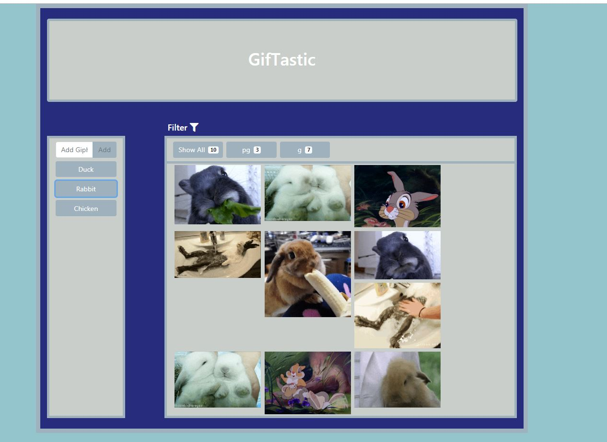

# Giphy API - Unit 6 HW

Welcome to the GifTastic. View the Gifs of your favorite animal. Here is a link to the [gif viewer](https://anw1986.github.io/unit-6-hw/)

## Getting Started

This is an app for getting your favourite gifs for your animal. Click on the button to see the images. Click on the image to see them animate. Click again to pause them. Also, the user can filter the gifs by rating. The user can add gify buttons to the list 

Screen shot of the home screen

Screen shot of when a button is clicked

## Game Design Notes & User Tests

Every effort has been put in to design & capture user exceptions including
* The initial screen has been designed very simple to enhance user experience
* Filter buttons added for the user to filter images by ratings
* If the giphy button is clicked again then another 10 records are displayed

### Coding tests

The code has been thorougly checked but exceptions are always there. This HW has heavy uses of jquery dynamic element creations including filter buttons. 

Classes have been indexed to provide ease of use for jquery. In order to get unique elements and their counts in the rating array, it was converted into object and then the key-value pair was pushed into an array

'''
  
  function transitionQuestion() {

            // creating an object for rating array. This will provide unique count for every rating
            // these unique count is used in creating the filter buttons
            var ratingCounts = {};
            for (var k = 0; k < rating.length; k++) {
                ratingCounts[rating[k]] = 1 + (ratingCounts[rating[k]] || 0);
            }

            console.log(ratingCounts);

            // creating an array to holding rating and it's respective counts
            var testRating = [];
            var testRatingCount = [];

            // looping through the object ratingCounts and pushing the object key-value pair in arrays
            for (var x in ratingCounts) {
                testRating.push(x)
                testRatingCount.push(ratingCounts[x])
            }

'''

## Built With

* [Bootstrap](https://getbootstrap.com/) - To build responsive website

## Authors

* **Ahmed Waheed** - *Unit 6 HW* - [Github Profile](https://github.com/anw1986) -[Portfolio](https://anw1986.github.io/Basic-Portfolio/)

